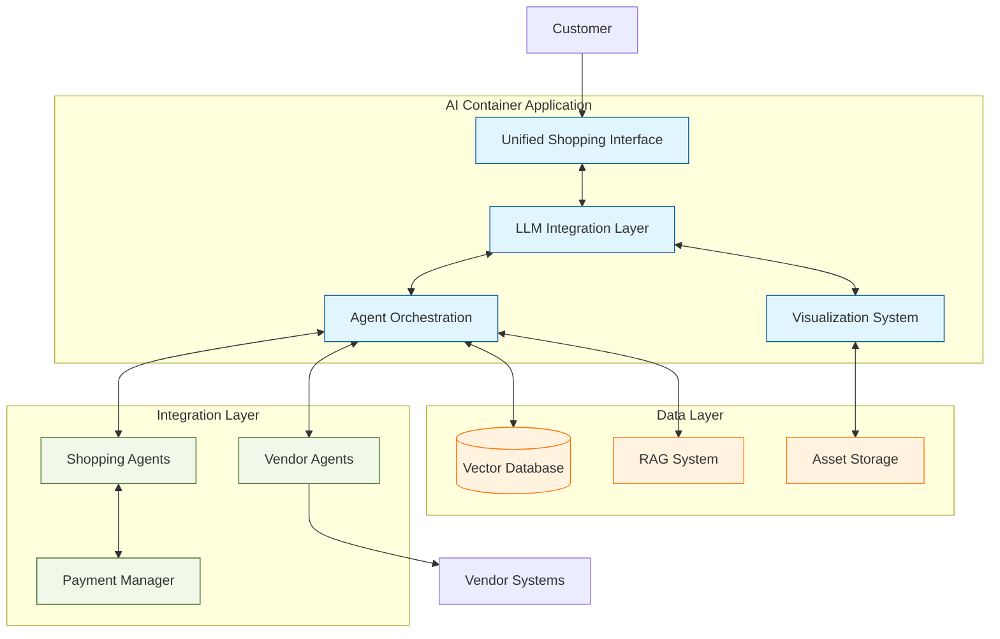
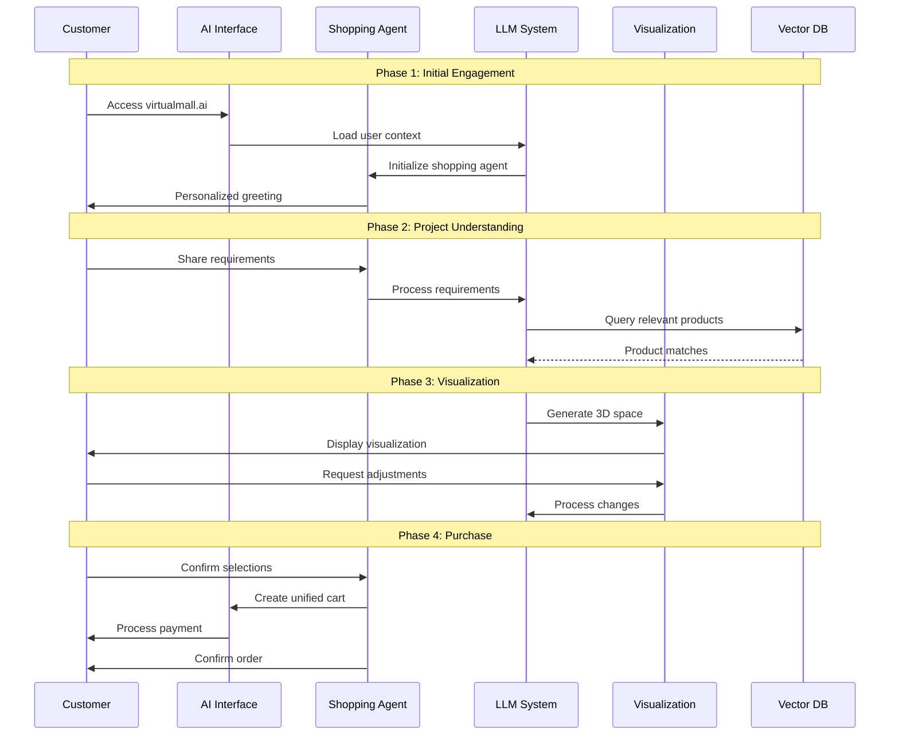

# The AI-Powered Virtual Mall: Revolutionizing Digital Commerce

## Introduction

The digital commerce landscape is about to undergo a revolutionary transformation with the introduction of an AI-powered virtual mall platform. This innovative system reimagines the traditional online shopping experience by combining advanced artificial intelligence, immersive visualization, and intelligent agent technology to create a truly next-generation shopping environment.

## The Vision

At its core, our AI-powered virtual mall represents a paradigm shift from conventional e-commerce to an intelligent, intuitive, and immersive shopping experience. By leveraging cutting-edge technologies such as Large Language Models (LLMs), vector databases, and autonomous shopping agents, we're creating a platform that understands, adapts to, and anticipates each customer's unique needs and preferences.

## Technical Architecture

The platform is built on three fundamental pillars: the AI Container Application, the Intelligent Data Layer, and the Integration Layer. This architecture enables seamless coordination between human interaction, artificial intelligence, and vendor systems.

### AI Container Application

At the heart of the platform lies our sophisticated AI Container Application, built using ASP.NET Core. This container serves as the central nervous system of the virtual mall, orchestrating all aspects of the shopping experience. It manages everything from user authentication and state management to real-time LLM interactions and generative storefront rendering.

### Intelligent Data Layer

The platform's intelligence is powered by a sophisticated data layer that combines vector databases with Retrieval-Augmented Generation (RAG) systems. This layer enables:

- Lightning-fast product discovery
- Contextual understanding of user preferences
- Real-time product recommendations
- Efficient storage and retrieval of visual assets
- Dynamic catalog management

### Integration Layer

The Integration Layer serves as the bridge between the AI system and various external services, including vendor systems, payment processors, and delivery services. Through intelligent agents, it manages complex multi-vendor transactions while maintaining a seamless user experience.

## The Shopping Experience

The AI-powered virtual mall transforms online shopping from a transactional process into an interactive, personalized journey. Here's how the experience unfolds:

### Initial Engagement

When customers enter the virtual mall, they're greeted by an intelligent shopping assistant that understands natural language and maintains context throughout the interaction. This assistant learns from each interaction, building a comprehensive understanding of the customer's preferences and needs.

### Project Understanding

The system excels at helping customers with complex shopping projects. Whether furnishing a home, planning a wardrobe, or organizing an event, the AI assistant gathers requirements through natural conversation while building a detailed understanding of the customer's vision.

### Visualization and Discovery

One of the platform's most compelling features is its ability to generate immersive 3D visualizations of products and spaces. Customers can:

- View products in realistic 3D environments
- Experiment with different combinations and layouts
- Make real-time modifications to their selections
- See how products will look in their intended space

### Unified Purchase Experience

The platform streamlines the traditionally complex process of multi-vendor purchasing into a single, coherent experience. The system handles all the complexity of coordinating multiple vendors, payment processing, and order tracking behind the scenes.

## Intelligent Agent System

The platform's capabilities are enhanced by a sophisticated network of AI agents that work together to deliver a seamless shopping experience:

### Shopping Agents
- Guide customers through their shopping journey
- Maintain context across multiple sessions
- Coordinate with visualization systems
- Handle purchase execution and tracking

### Vendor Integration Agents
- Manage real-time catalog synchronization
- Process orders across multiple vendors
- Monitor inventory levels
- Handle transaction reporting

## Future Innovations

The platform's roadmap includes exciting developments in several areas:

- Advanced generative AI capabilities for dynamic storefront creation
- Enhanced 3D visualization and augmented reality features
- Predictive commerce capabilities
- Autonomous shopping agents with advanced decision-making abilities
- Cross-vendor intelligence for better product recommendations

## Conclusion

The AI-powered virtual mall represents more than just an evolution in e-commerce; it's a complete reimagining of the digital shopping experience. By combining advanced AI technologies with immersive visualization and intelligent agents, we're creating a platform that not only meets current shopping needs but anticipates and shapes the future of digital commerce.

This platform maintains our commitment to secure, network-based commerce while introducing unprecedented levels of personalization, convenience, and intelligence. As we continue to develop and enhance these capabilities, we're not just building a shopping platform – we're creating the future of digital retail.
