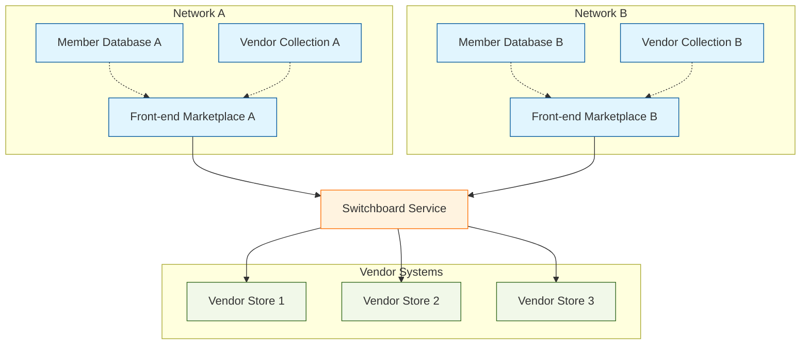

# Virtual Mall Network System

## Introduction

The Virtual Mall Network System represents a revolutionary approach to digital commerce, enabling the operation of multiple independent networks of vendors and customers within secure, isolated environments. This document outlines the architecture and implementation of this sophisticated platform, which seamlessly bridges the gap between marketplace discovery and individual vendor operations.

## System Architecture

At its core, the system operates as a distributed network of interconnected components, each serving a specific purpose in the overall ecosystem. The architecture follows a "walled garden" approach, ensuring that each network maintains its independence while benefiting from the platform's shared infrastructure.

### Front-end Marketplace

The journey begins at our front-end marketplace, which serves as the gateway to our virtual mall ecosystem. This sophisticated portal does more than simply list vendors – it acts as an intelligent intermediary, managing network-specific access control and handling the complex task of secure customer transitions. The marketplace employs advanced session management techniques and generates secure tokens for store transfers, ensuring that each customer's journey is both seamless and secure.

### Switchboard Service

The switchboard service stands as the architectural centerpiece of our platform, orchestrating all cross-system communications with precision and security. This intelligent routing system manages the complex dance of request validation, token-based transfers, and transaction tracking. Built on a RESTful architecture, the switchboard service ensures that each customer transition between systems is smooth, secure, and properly recorded.

### Vendor Integration System

Our vendor integration system represents a triumph of flexibility and security working in harmony. Through a sophisticated plugin architecture, we've created a standardized way for vendors to integrate with our platform while maintaining their unique e-commerce implementations. Each plugin serves as a secure bridge, validating incoming transfers, tracking purchases, and maintaining consistent communication with our switchboard service.

## Security Framework

Security permeates every aspect of our system's design. The authentication system employs a multi-layered approach, with validations occurring at the front-end, switchboard, and vendor levels. This comprehensive security framework ensures that only authorized users can access appropriate network resources, while maintaining the isolation between different networks.

## Network Architecture

The system's multi-network support represents one of its most powerful features. Each network operates as an independent entity with its own member database, vendor collection, authentication rules, and access control policies. This architecture enables the platform to serve diverse communities while maintaining strict separation between networks.

## Transaction Processing

The customer journey through our system is carefully orchestrated to maintain security while providing a seamless experience. When a customer selects a vendor store, they trigger a sophisticated sequence of events:

1. The front-end marketplace initiates the journey by generating secure tokens and encrypted parameters.
2. Our switchboard service validates and processes the request, ensuring all security requirements are met.
3. The customer is seamlessly transferred to the vendor's store through a secure redirect process.
4. The vendor's plugin validates the transfer and enables access to the store.
5. Throughout the process, comprehensive transaction tracking ensures full visibility and reporting capabilities.

## Technical Implementation

The system is built on a robust technical stack that prioritizes security, scalability, and reliability. Our cloud-based infrastructure employs a distributed architecture with high-availability design principles. The platform integrates seamlessly with various e-commerce platforms, payment systems, and membership systems, while maintaining strict security protocols.

## Monitoring and Analytics

Comprehensive monitoring and analytics capabilities are built into every layer of the system. Our monitoring framework tracks service health, performance metrics, and security events in real-time. The business analytics system provides detailed insights into transaction patterns, member activity, vendor performance, and network usage.

## Future Considerations

While our current implementation provides a solid foundation for secure e-commerce operations, we recognize several areas for potential enhancement:

- The traditional web architecture could be modernized to improve performance and flexibility
- Vendor discovery mechanisms could be enhanced with AI-driven recommendations
- Analytics capabilities could be expanded to provide deeper insights
- Cross-network intelligence could be implemented to improve the overall user experience
- Member-vendor relationships could be made more dynamic and personalized

## Conclusion

The Virtual Mall Network System represents a sophisticated solution for managing multiple independent e-commerce networks within a secure and scalable framework. Its architecture ensures the secure operation of isolated vendor-customer networks while maintaining the flexibility to adapt to changing business needs.
