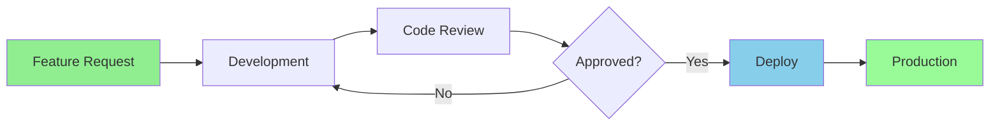

# Development Workflow

This diagram illustrates our basic development workflow from feature request to deployment.

## Diagram Explanation

The workflow consists of these key steps:

1. Feature Request: New feature is requested and documented
2. Development: Feature is implemented by developers
3. Code Review: Team reviews the code changes
4. Approval Gate: Changes are either approved or sent back for revision
5. Deploy: Approved changes are deployed
6. Production: Feature is live in production environment
